# Red Hat OpenShift Streams For Apache Kafka support

### Installation

You can either:
1. search for and install `Red Hat OpenShift Application Services` directly from the `Extensions` view, it will automatically install its dependencies, [Tools for Apache Kafka](https://github.com/jlandersen/vscode-kafka) and [Red Hat Authentication](https://github.com/redhat-developer/vscode-redhat-account)
2. in the Kafka explorer from `Tools for Apache Kafka`, click on the `Discover Kafka Providers` command, which will automatically perform a search for Kafka providers (see option 1).

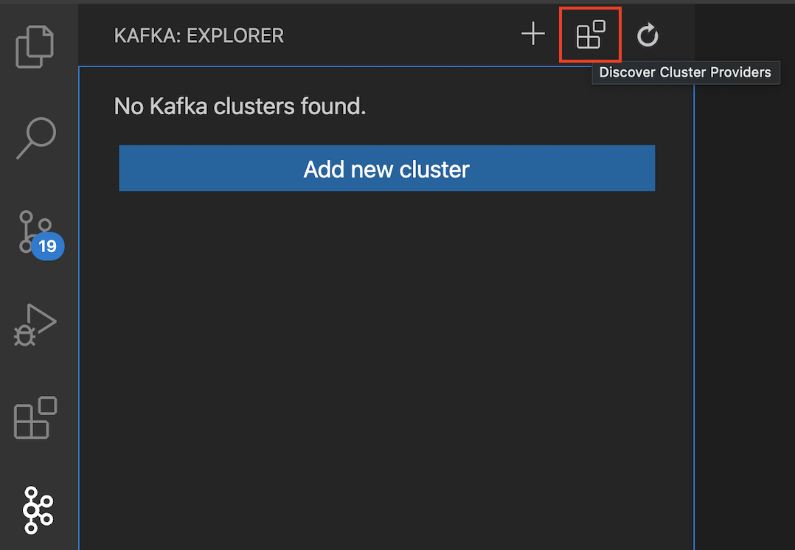

### Adding an existing cluster
Once `Red Hat OpenShift Application Services` is installed, open the Kafka view. Clicking on the `Add new cluster` button (or `+`) in the Kafka Explorer will bring up the options to create new clusters. Select `Red Hat OpenShift Streams For Apache Kafka`:

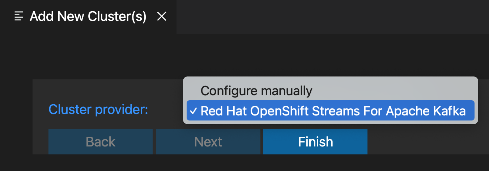

You will be asked to log into your Red Hat account first:

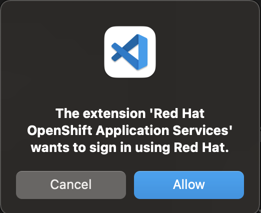

This will open a browser page to sign into https://sso.redhat.com. Once you signed-in or created an account, your session token will be stored in the IDE, so it can be reused (and refreshed) if necessary.

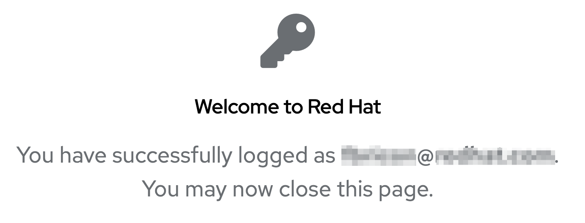

This first sign-in operation will allow the discovery of your existing `Red Hat OpenShift Streams For Apache Kafka` clusters.

If no clusters have been created yet, a pop-up will let you [create a new remote custer](#create-a-new-remote-cluster) or open the [dashboard](https://cloud.redhat.com/beta/application-services/streams/kafkas):

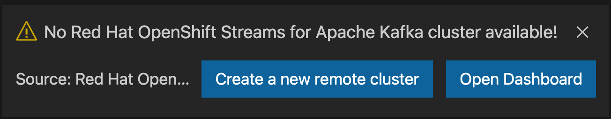

If you already created your Apache Kafka cluster, the extension will require to you to sign into a second SSO, so it can connect to that cluster via SASL/OAUTHBEARER.

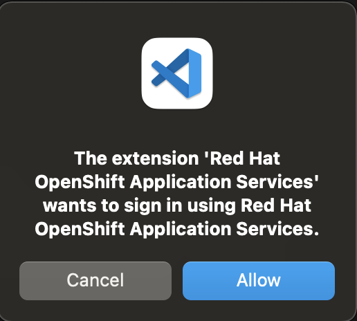

That second sign-in is transparent though, you won't need to manually log in.

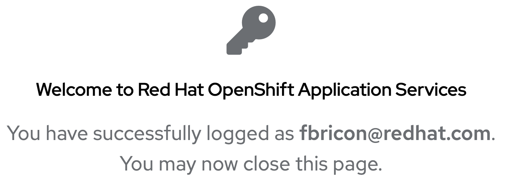

Finally, your cluster(s) will automatically be added to the Kafka Explorer.

Here's an example of the workflow, when the user already logged in their Red Hat account:
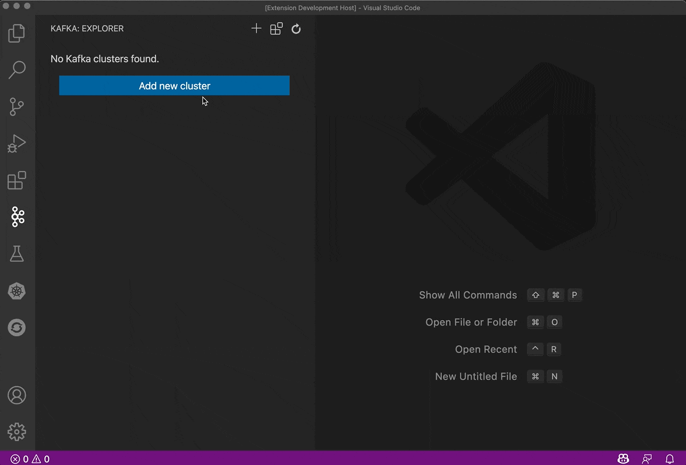

Please read the [`Tools for Apache Kafka` documentation](https://github.com/jlandersen/vscode-kafka/blob/master/docs/README.md) and learn how to manage your Kafka clusters and topics and how to produce or consume messages.

### Create a new remote cluster

If you want to create a new remote cluster, you can do so by clicking on the `Create new remote cluster` button, after trying to discover existing clusters. You will then need to select:
- a cluster name,
- the cloud provider (only `Amazon Web Services` is available at the moment),
- the cloud region (only `us-east-1` is available at the moment),
- multizone (`true` is the only choice at the moment).

Creating the cluster usually takes 3 to 4 minutes. 
A progress dialog will be displayed while the cluster is being created. 
In the meantime, the web dashboard will be opened to show you the status of the cluster.

Here's an example of the workflow:

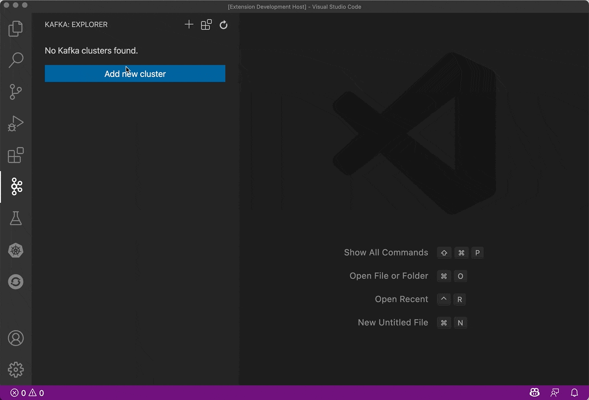

Alternatively, you can also create a remote cluster from the `Red Hat: Create a Red Hat OpenShift Streams For Apache Kafka cluster` command, available from the command palette (F1):

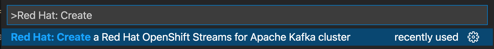

### Red Hat OpenShift Streams For Apache Kafka specific menus

`Red Hat OpenShift Streams For Apache Kafka` clusters display specific menus when you right-click on them:
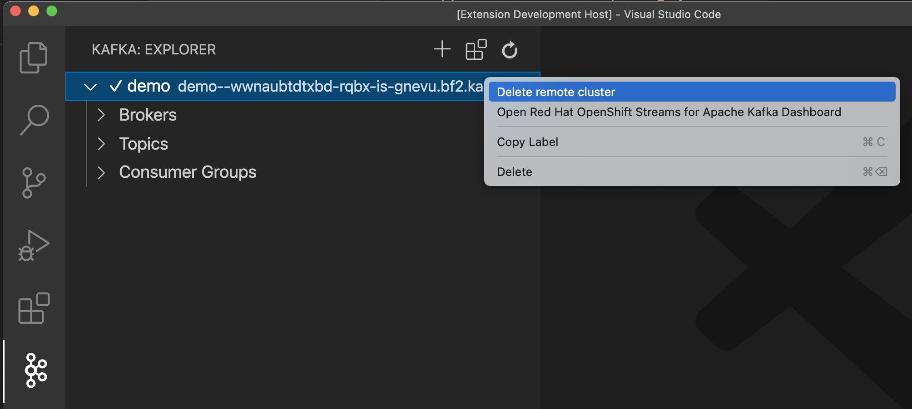

You can either open the Dashboard:
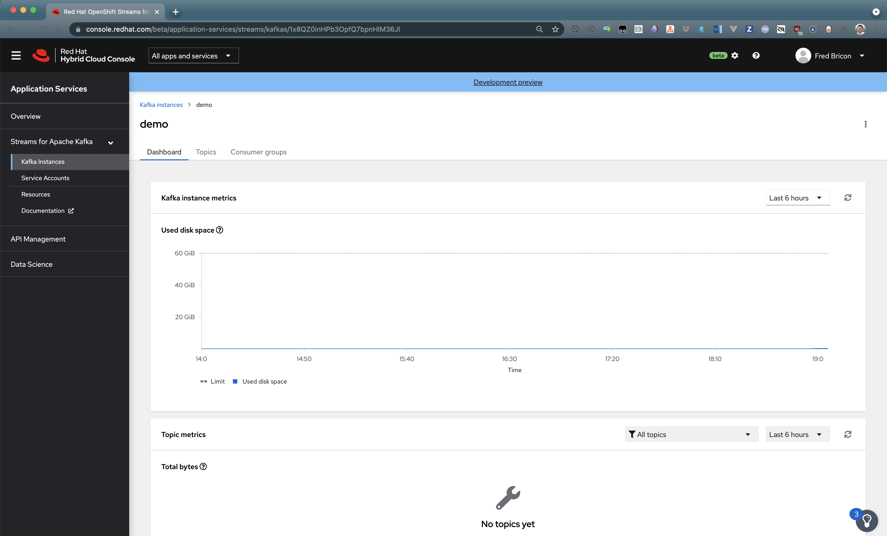

Or delete the remote cluster:

### About ephemeral clusters

Please be aware ephemeral [`Red Hat OpenShift Streams For Apache Kafka`](https://cloud.redhat.com/beta/application-services/streams/kafkas) clusters are not automatically purged from the Kafka settings after they have been deprovisioned. You will need to [delete](https://github.com/jlandersen/vscode-kafka/blob/master/docs/Explorer.md#delete) them manually from the Kafka Explorer.